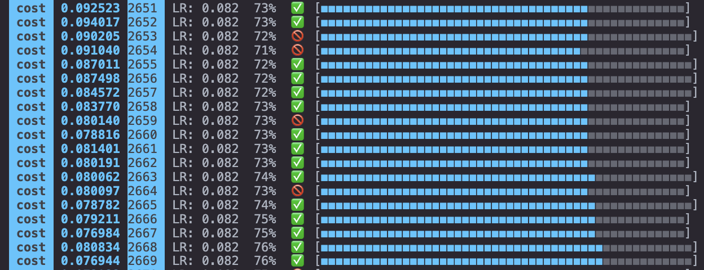

## Feed-forward neural network written in rust

Took me quite some time to get working, but was worth it in the end. The picture above shows a quite small network training on classifying the MNIST dataset for hand written digits.

Why did I write it from scratch? I thought it would be a fun challenge, and I knew that I was going to learn a lot about maths, programming and AI along the way which I'm quite satisfied with.